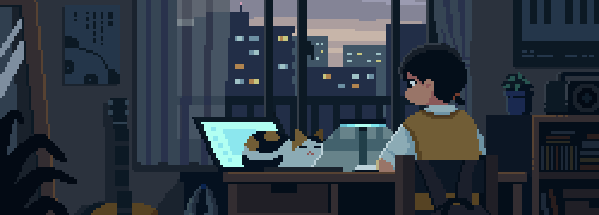

<h1 align="left">Hello👋, I'm Shreeya Pandey</h1>

<h3 align="left">I'm an AI Developer (more like researcher)</h3>

- Conference Paper on Brain Tumor Detection on IEEE Xplore [Paper](https://ieeexplore.ieee.org/document/10991161)

- How to reach me [Mail](mailto:shreeya2005pandey@gmail.com)

- Ask me about **ComputerVision** **NLP** **Tensorflow** **PyTorch** **LLM** **ML Models**

- Appreciation from CEO, UIDAI and Deputy Director General, RO Lucknow for my work [The Letter](https://drive.google.com/file/d/1QreQQpiMZJwgKs6lVkQk5Lhi-9WmJFcT/view?usp=sharing)

## Language and Tools
<h3 align="left">Languages and Tools:</h3>
                    

## Connect with me

  
  
  
  
  

  
  
  

